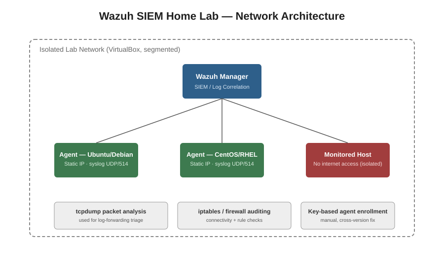

# Wazuh SIEM Home Lab — Attack Simulation & Detection

A self-built, segmented home lab used to deploy and administer a Wazuh SIEM for real-time log
monitoring, incident triage, and troubleshooting across a multi-OS network — built to practice
the day-to-day work of a SOC Analyst.

## Overview

- *Environment:* VirtualBox, 3-node isolated network
- *SIEM:* Wazuh Manager centralizing log collection from all agents
- *Hosts:* Ubuntu/Debian, CentOS/RHEL agents + one isolated "monitored" host with no internet access
- *Goal:* Simulate a small monitored enterprise environment and practice detection, triage, and troubleshooting end-to-end — not just install-and-forget.

## What I Built

1. *Deployed and administered a Wazuh SIEM manager* to centralize log collection and monitor the 3-node network for security events.
2. *Configured remote syslog ingestion (UDP/514)* — including editing ossec.conf and troubleshooting XML configuration errors — to enable real-time log forwarding from monitored hosts.
3. *Built and segmented a multi-OS lab network* (Debian/Ubuntu, CentOS/RHEL) with static IP addressing to simulate a realistic monitored environment.
4. *Applied defense-in-depth principles* by isolating the vulnerable/monitored host from internet access, using controlled internal file transfer for any tooling that needed to reach it.

## Problems I Ran Into (and Fixed)

*Log-forwarding pipeline failure*
Logs stopped reaching the manager from one agent. I used tcpdump for packet-level traffic analysis, checked running processes on the agent, and audited firewall/iptables rules to isolate where the pipeline was breaking — traced it back to a blocked outbound rule.

*Agent–manager compatibility issues*
Ran into architecture mismatches and cross-version protocol conflicts between agents and the manager. Resolved this through manual, key-based agent enrollment instead of the default auto-enrollment flow.

## Skills Practiced

Wazuh SIEM administration syslog tcpdump iptables Linux (Ubuntu, CentOS/RHEL) network segmentation incident triage root-cause troubleshooting

## Notes

This repo documents a personal lab project used for learning, not a production deployment. Configuration snippets are sanitized/simplified for sharing.
